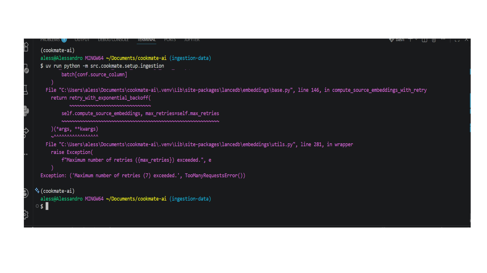

# Cookmate-ai.

## Project Structure (Working Map)

This section describes the purpose of each file and folder.  
Each team member can update this file from their own branch to document their work.  
This map will be removed before final submission.
## Git Workflow (Team Guidelines)

Follow this workflow to avoid conflicts and keep the project clean.

---

### 1. Always start from an updated main

```bash
git checkout main
git pull origin main
```
### 2. Create a new branch for your task

git checkout -b feature/your-task-name

### 3. 3. Work on your code
classic 
git add .
git commit -m "..."
git push origin feature/your-task-name 

### 4.  Create a Pull Request (PR)
On GitHub:
Click "Compare & pull request"

### 5. Review

### 6. Merge

### 7. After merge (IMPORTANT) 
git checkout main
git pull origin main

---

### Root
create a 
.env → environment variables 
COHERE_API_KEY=...personal key
OPENROUTER_API_KEY= ... personal key

then:
uv sync
I have installed the same dependences of the cours icnliding python 3.13

---

### data/

data/raw/ → raw datasets 
data/processed/ → cleaned dataset ready for ingestion  
data/evaluation/ → evaluation samples for testing the system  

---

### db/

db/recipes.lance/ → LanceDB vector database (embedded recipes)  

---

### notebooks/

notebooks/data_curation.ipynb → dataset filtering and preprocessing  
notebooks/exploration.ipynb → experiments and testing ideas  

---

### prompts/

prompts/recipe_agent_system_prompt.md → main system prompt for the agent  
prompts/retrieval_evaluation_prompt.md → prompt for evaluation/testing  

---

### mlruns/

mlruns/ → MLflow tracking data (runs, logs, experiments)  

---

### src/cookmate/

__init__.py → package initialization  

---

#### backend/

api.py → FastAPI endpoints  
agents.py → PydanticAI agent + retrieval tool  
data_models.py → request/response models + LanceDB schema  
constants.py → paths, model names, configuration  
middleware.py → logging and MLflow tracing

---

#### frontend/

app.py → Streamlit UI (user input and output display)  

---

#### setup/

prepare_dataset.py → prepare and format cleaned dataset  
ingestion.py → create embeddings and store data in LanceDB  

---

#### monitoring/

evaluation_dataset.json → test queries for evaluation  
monitoring.ipynb → evaluation and MLflow analysis  

---

#### utils/

config.py → environment loading and shared configuration  

---

### tests/

test_api.py → basic API tests  


_______________________________________________________________________________________________
## Data Preprocessing

We built a preprocessing pipeline to transform a large raw dataset into a clean and usable dataset for the RAG system.

### Steps performed

1. **Dataset loading**
   - Source: RecipeNLG dataset (Kaggle)
   - Loaded a subset for exploration

2. **Column selection**
   - Kept: `title`, `directions`, `NER`, `genre`
   - Dropped irrelevant columns

3. **Column renaming**
   - `directions` → `instructions`
   - `NER` → `ingredients`

4. **Genre filtering**
   - Removed: `drinks`, `fastfood`, `fusion`

5. **Data conversion**
   - Converted string fields to Python lists using `ast.literal_eval`

6. **Ingredient-based filtering**
   - Applied keyword-based filtering to keep relevant (European-style) recipes

7. **Full dataset processing**
   - Applied preprocessing to the entire dataset using chunked reading

8. **Final dataset creation**
   - Built structured JSON with:
     - id
     - title
     - ingredients
     - instructions
     - text (combined field for embeddings)

### Output

Final dataset stored at:
`data/processed/recipes_clean.json`

Dataset size:
- ~2870 recipes

Note:
- Raw dataset is not included in the repository (`data/raw/` is ignored)
- Preprocessing is reproducible via the notebook
- The dataset is optimized for embedding and retrieval (RAG pipeline)

# Rag 
## Overview

This project implements a full RAG pipeline:
- data preprocessing
- vector database creation
- semantic retrieval
- LLM-based response generation

---

## Embeddings

Initial approach:
- Cohere embeddings
- Not scalable due to API rate limits

### Cohere embedding attempt (running)


### Cohere embedding failure due to rate limits



Final approach:
- Local embeddings with SentenceTransformer (`all-MiniLM-L6-v2`)
- Faster and stable ingestion

---

## Vector Database

- Technology: LanceDB
- Path: `/db/recipes.lance`
- Stores embeddings for semantic search

---

## Retrieval

- Query is converted into an embedding
- Similar recipes are retrieved via vector similarity

---

## Generation

- LLM via OpenRouter
- Combines:
  - user query
  - retrieved recipes

---

## Architecture

User Query  
→ Embedding  
→ Vector DB (LanceDB)  
→ Retrieved Recipes  
→ LLM (OpenRouter)  
→ Response  

---

## Notes

During development, we evaluated different embedding solutions.  
We initially attempted to use Cohere embeddings but encountered rate limits during ingestion.

To address this, we switched to a local embedding model (SentenceTransformer), following best practices for scalability. AI-assisted tools were used to learn and explore this alternative solutions.

