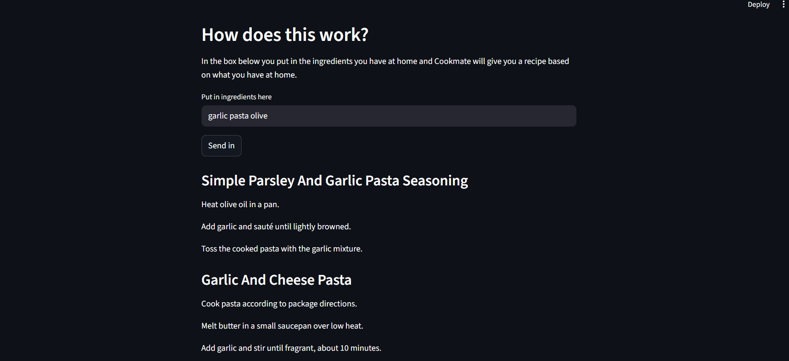
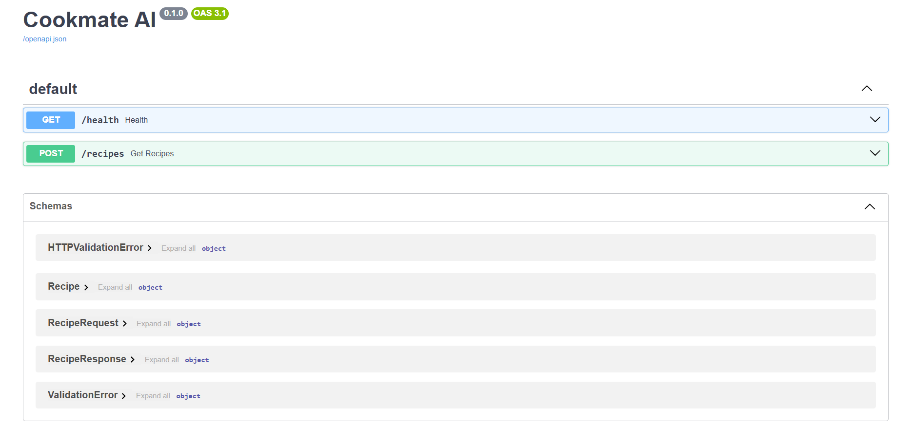
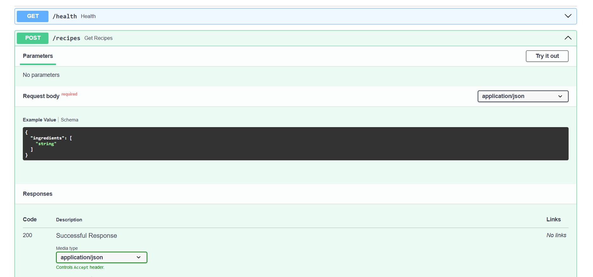
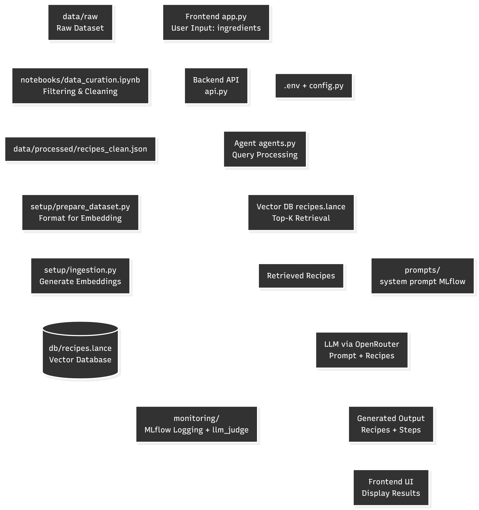
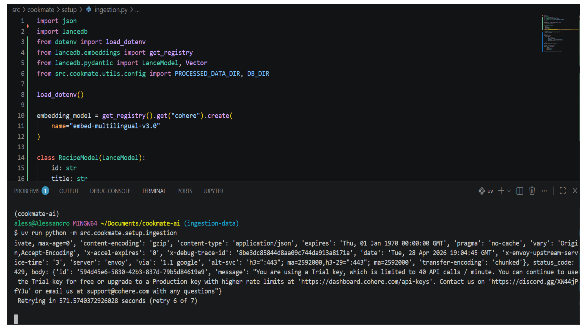

# Cookmate AI

A RAG-powered recipe assistant that suggests recipes based on the ingredients you have at home.

## Demo





## Architecture


The system has an offline pipeline that cleans, embeds, and stores recipes in a LanceDB vector database, and an online pipeline where the frontend sends ingredients to the backend, retrieves relevant recipes, calls the LLM via OpenRouter, and returns structured recipe suggestions.

Backend and frontend run as two Docker containers, deployed on Azure Container Apps.

---

## Tech Stack

- **Backend:** FastAPI, PydanticAI
- **Embeddings:** sentence-transformers (`all-MiniLM-L6-v2`)
- **Vector DB:** LanceDB
- **LLM:** OpenRouter
- **Frontend:** Streamlit
- **Monitoring:** MLflow
- **Containerization:** Docker, docker-compose
- **Deployment:** Azure Container Apps

---

## Setup

Install dependencies:

```bash
uv sync --all-packages
```

Create a `.env` file in the project root:

```
OPENROUTER_API_KEY=your_openrouter_key
```

Build the vector database:

```bash
uv run python src/cookmate/setup/ingestion.py
```

Register the system prompt in MLflow:

```bash
uv run python src/cookmate/monitoring/mlflow_prompts.py
```

---

## Running the App

**Locally:**

```bash
uv run --package cookmate-backend uvicorn backend.api:app --reload --host 127.0.0.1 --port 8000
```

```bash
API_URL=http://localhost:8000 uv run --package cookmate-frontend streamlit run src/cookmate/cookmate-frontend/frontend/app.py
```

**With Docker:**

```bash
docker compose up --build
```

- Frontend: `http://localhost:8501`
- Backend docs: `http://localhost:8000/docs`
- Health check: `http://localhost:8000/health`

---

## MLflow

Start the MLflow UI:

```bash
uv run mlflow ui
```

If port 5000 is unavailable, specify a different port:

```bash
uv run mlflow ui --host 127.0.0.1 --port 5001
```

Run the LLM judge:

```bash
uv run python src/cookmate/monitoring/llm_judge.py
```

---

## Data Pipeline

The recipe dataset was curated from dataset (Kaggle): loaded, filtered by genre and ingredients, restructured, and converted into a JSON file with around 2,870 recipes. The final dataset is stored in `data/processed/recipes_clean.json` and is reproducible with `notebooks/data_curation.ipynb`.

---

## Embeddings

We initially used Cohere embeddings but ran into rate limits during ingestion. We switched to local embeddings with sentence-transformers (`all-MiniLM-L6-v2`), which was faster and more stable for our dataset size.

